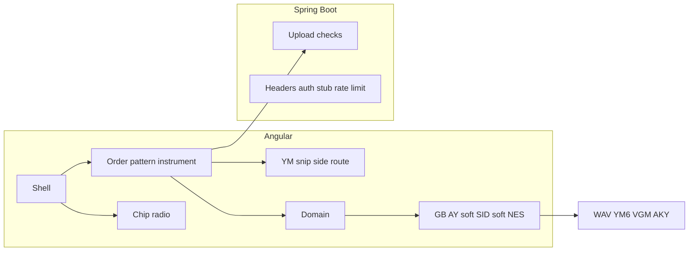

# Chippy

A web tracker for writing Game Boy, Vectrex, C64, Atari ST, and NES chiptunes. Keep it as simple as LSDJ and support various 8-bit chips.

**Current state:** Two shell tabs — **Tracker** (Order → Patterns → Instruments, multi-song Project v2, live Web Audio) and **Radio** (curated third-party chip streams with viz). YM snip lives on a side route from the tracker. Chippy-hosted submit / vote / rotation for Radio is still backlog.

## What it can do

- One screen with Song Order, every channel, and the instrument studio.
- A project holds one chip, a shared instrument bank, and one or more songs.
- Game Boy (PU1/PU2/WAV/NOI), Vectrex (three tone channels), C64 (three SID voices), Atari ST (YM2149 tones), and NES (PU1/PU2/TRI/NOI).
- Pattern grid columns: note, instrument, volume, and FX. Non-Game-Boy chips use the shared FX set (`A`/`U`/`D`/`R`/`C`/`P`). Game Boy uses full LSDJ phrase commands with hex values (`00`–`FF`), with chip-aware FX help, an inspector when the FX column is focused, and an on-demand LSDJ FX reference (`?` or the FX button).
- Instrument studio: rename/type/delete, pitch audition, chip-specific hardware controls, free and premium presets grouped by role then kind (`presets.unlockAll` in config unlocks premium for local/dev). Save project-scoped custom presets from the armed instrument.
- Changing chip starts a new blank project after confirm. Opening a project warns when the session is dirty.
- The keyboard plays a note as you write it. Undo, mute, and solo are on that screen.
- Vaporwave, dark, and plain paint, chosen from a Paint dropdown (defaults to vaporwave).
- A short opening animation. Set `splashEnabled` to `false` in `frontend/public/config.json`, or `chippy.splash.enabled` in `chippy-api/src/main/resources/application.yml`.
- Save a `.chippy.json` project (v4) and open one again. Legacy v1–v3 files migrate on open (Game Boy v3 shared FX remaps toward LSDJ commands). Open Project accepts `.chippy.json` and Game Boy **LSDJ `.sav`** (chains flatten into Song Order). YM snip parse entirely in the browser (no API required); optional server validate endpoints remain for later hardening.
- Create a random song after a warning and typing YES.
- Export WAV (all chips), YM6 (Vectrex and Atari ST), Vectrex AKY, Game Boy VGM, and Game Boy **LSDJ `.sav`** (128KB flash-cart save).
- Open a YM beside the song, play a range, and keep it as an instrument.
- Radio tab: Rainwave Chiptunes, CVGM, and Nectarine streams; reconnect on stall; Rainwave now-playing titles when the API answers.
- Optional Buy Me a Coffee prompt and Google AdSense slot, both off until you configure them. See [MONETIZATION_SETUP.md](MONETIZATION_SETUP.md).
- API rate limits on upload validation to reduce abuse.

## Later

See [FUTURE.md](FUTURE.md) for the backlog: Chains/tables/grooves UI after LSDJ `.sav` import, mobile web tracker (Tracker tab is desktop-only for now), deeper NES/SID tools, Chippy-owned YM Radio, and real donor sign-in.

## Run it locally

You need Java 21 and Node 22.22 or 24.15 or newer. The scripts in `scripts/` use a portable JDK and Maven under `.tools` when those archives are present, and they download Node 24 into `.tools` when the installed Node is older than that.

- `scripts/dev.cmd` or `scripts/dev.sh` starts the API on port 8080 and the Angular app on port 4200, waits until the UI answers, then opens `http://localhost:4200` in your browser. Logs: `logs/dev-api.log` and `logs/dev-ui.log`.
- `scripts/dev-ui.cmd` / `scripts/dev-ui.sh` starts only Angular.
- `scripts/dev-api.cmd` / `scripts/dev-api.sh` starts only Spring Boot.
- `scripts/build.cmd` / `scripts/build.sh` packages the WAR and writes `logs/build.log`.

IntelliJ and VS Code both open this repository. Java lives in `chippy-api`. Angular lives in `frontend`.

Frontend tests (`npm test`) and API tests (`mvn -pl chippy-api test`) enforce about 80% coverage on the libraries and API code under test.

## Hosting

The same Spring Boot app is packaged three ways.

- **WebSphere Liberty.** `mvn -B package` writes `chippy-api/target/chippy.war`. Drop it on Liberty with `deploy/liberty/server.xml` (`servlet-6.0`). `java -jar` also runs that WAR. Traditional WebSphere 8.5 and 9 cannot run it.
- **OpenShift.** Build `deploy/Containerfile`, then `oc apply -f deploy/openshift`. There is no Jenkinsfile. Probes use `/api/health`.
- **Oracle ARM VM.** Copy the WAR to an Ampere A1 instance and run it with Temurin 21. Stay at or under 2 CPUs and 12 GB. Put Caddy or nginx on port 443 and forward to `127.0.0.1:8080`. Details are in `deploy/arm/README.md`.

## Architecture

Sound is rendered in the browser. The server checks uploads and serves the page. See `ARCHITECTURE.md`.
